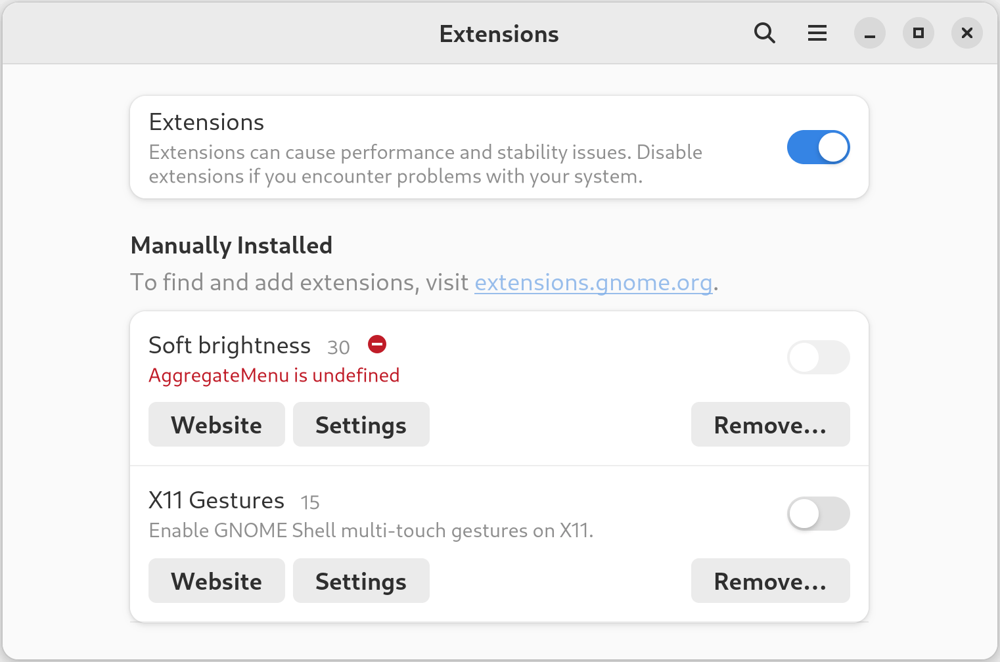

I used to be an exclusive user of tiling window managers, namely: [xmonad](https://xmonad.org/).  When I converted over to the GNOME world, I tried all of the window tiling extensions and settled on the excellent [PaperWM](https://github.com/paperwm/PaperWM).  But PaperWM, as with most GNOME extensions, struggled to keep up with the rapid pace of GNOME releases, and I was stuck on vanilla GNOME for some time.

Recently, Arch pushed the GNOME 43 release, and, surprise! I lost another extension that I have come to love: Philippe Troin's [Soft Brightness](https://github.com/F-i-f/soft-brightness).  This extension takes the existing brightness control in GNOME, and extends the darkest setting past the limits of the physical display by adjusting gamma settings.  (In other words, it prevents you from going blind when working in a dark room.)  There was an [open issue for GNOME 43 support](https://github.com/F-i-f/soft-brightness/issues/58) on the Soft Brightness GitHub page, but before I wrote this post, no progress had yet been made.  Rather than downgrading GNOME and waiting patiently, I decided to take matters into my own hands.


# Update `metadata.json` and hope for the best

First of all, let's clone the Soft Brightness repository, and update `metadata.json` to claim support for GNOME 43.

```diff
diff --git a/src/metadata.json.in b/src/metadata.json.in
index e4af9c3..33595f6 100644
--- a/src/metadata.json.in
+++ b/src/metadata.json.in
@@ -12,7 +12,8 @@
     "3.38",
     "40",
     "41",
-    "42"
+    "42",
+    "43"
   ],
   "url": "https://github.com/F-i-f/soft-brightness",
   "uuid": "@uuid@",
```

The documentation shows the incantation to build and install the extension: `meson build && ninja -C build install`.  Great!  Let's re-enable the extension and see what happens.



Okay... so that didn't work very well.  There's something wrong with AggregateMenu.  Coincidentally, the guide for [porting extensions to GNOME 43](https://gjs.guide/extensions/upgrading/gnome-shell-43.html#quick-settings) mentions that AggregateMenu has been replaced with QuickSettings.  No problem!  We just need to search-and-replace a few strings, and the extension is ready for action.  But... seems like there's no way to "reload" the extension in a running GNOME session.

# Reload GNOME extensions

GNOME might not allow reloading extensions dynamically, but there is a simple workaround: reload `gnome-shell` instead.  For all of you X11 users, go ahead and press Alt+F2 right now, type the `r` command, and hit \<Enter>.  Tah-dah!  For all of you Wayland users... I feel your pain.


Whereas X11 architecture separates the X server (e.g. Xorg) from the compositor (e.g. Mutter or `gnome-shell`), Wayland architecture merges the two, and `gnome-shell` also takes on the equivalent role of an X server.  [(More reading for those interested.)](https://wayland.freedesktop.org/docs/html/ch03.html#sect-Wayland-Architecture-wayland_architecture)  Thus, reloading `gnome-shell` in Wayland effectively brings down the entire session along with all of your running applications.

 X Server and (5) Compositor are merged.")

Apparently it's pretty easy to run a nested `gnome-shell` in Wayland, but it seems to have a lot of strange issues.  For example, opening up most applications from the nested window results in them being opened in... the parent `gnome-shell`.  Huh?  Also, there is no brightness control in the nested window, which is pretty important if we are to get Soft Brightness working.  So... until we figure out [how to get containers involved](), I'm sad to say that the easiest route is to temporarily switch over to an X11 session.

# Set up the development environment

Once there, we can get our development workflow going:

1. Make changes to the extension source code
2. `ninja -C build install`
3. Alt+F2, `r` \<Enter>
4. Close and re-open `gnome-extensions-app`
5. Attempt to enable extension


Or for those who enjoy stringing commands together and avoiding tinkering with the UI:

```sh
$ gnome-extensions disable soft-brightness@fifi.org && \
    ninja -C build install && \
    killall -HUP gnome-shell && \
    sleep 3 && \
    gnome-extensions enable soft-brightness@fifi.org
```

Sometimes the one-line error provided by `gnome-extensions-app` is enough to track down the latest error.  But we can get more information (a full stack trace) by watching `gnome-shell` logs while reloading extensions.  On a systemd-based distribution, that amounts to running `journalctl -f _COMM=gnome-shell`.

# Explore with Looking Glass

I quickly discovered that `s/AggregateMenu/QuickSettings/g` wasn't going to cut it.  My heart yearned for Chrome Developer Tools, which lets you click a UI element to inspect its properties and position in the DOM.  And then the heavenly words appeared, glowing softly in my Google search results: [Looking Glass](https://wiki.gnome.org/Projects/GnomeShell/LookingGlass).  Although nowhere near as advanced as Developer Tools, it allows us to inspect the JavaScript world of a running instance of `gnome-shell`, and interactively make modifications.

Looking Glass is accessible via Alt+F2 and then `lg`.  Honestly, it's somewhat frustrating to use, since it blocks interaction with the UI until closed with \<Esc>.  But for our purposes, it should be more than sufficient.


To familiarize ourselves with QuickSettings, let's see if we can remove the brightness indicator.  In order to figure out the correct set of instructions, we refer to (1) existing Soft Brightness code, (2) the commit used to convert the brightness indicator over to QuickSettings ([status/brightness: Port to quick settings](https://gitlab.gnome.org/GNOME/gnome-shell/-/commit/7bbd59838a6cfe14b189fa7bd8e743fb0cac9bc3)), and (3) an extension for customizing QuickSettings ([Quick Settings Tweaker](https://github.com/qwreey75/quick-settings-tweaks/blob/e7eab279bbe2cfaeb59a7068808166ac7c5c046d/features/dndQuickToggle.js)).  We lather liberally with trial and error, and come out with this JavaScript sequence:

```javascript
QS = imports.ui.main.panel.statusArea.quickSettings;
b = QS._settings;
bi = b.quickSettingsItems[0];
bi._proxy.run_dispose();
bi.get_parent().remove_child(bi);
b.get_parent().remove_child(b);
b.destroy();
```


And... it's gone! Well, that's rather satisfying, but slightly awkward. Let's reload `gnome-shell` to get it back.  (Again, sorry Wayland users!)

# Current strategy used by Soft Brightness

In current Soft Brightness code, the brightness indicator class is extended, and functions are overridden to serve the extension's needs.  When the extension is enabled, the modified class is instantiated, and the existing brightness indicator is swapped out with the modified one:

```javascript
const Indicator = imports.ui.status.brightness.Indicator;

class ModifiedBrightnessIndicator extends Indicator {
    _sliderChanged(slider) { ... }
    _sync() { ... }
}
```

It turns out that in the process of converting the brightness indicator to QuickSettings [(GitLab commit)](https://gitlab.gnome.org/GNOME/gnome-shell/-/commit/7bbd59838a6cfe14b189fa7bd8e743fb0cac9bc3#e220cd54002c151792a62cbc832b05dd3ad65ad0_20_16), the `Indicator` class was renamed, made private, and hidden behind a wrapper class called `SystemIndicator`:

```javascript
// Class is private to this module and not exported
class BrightnessItem extends QuickSlider {
    _sliderChanged(slider) { ... }
    _sync() { ... }
}

// Class is exported as imports.ui.status.brightness.Indicator
class Indicator extends SystemIndicator {
    _init() {
        this.quickSettingsItems.push(new BrightnessItem());
    }
}
```

Rather than completely re-implementing the new `BrightnessItem` class and dealing with spaghetti code for handling `gnome-shell` 42/43 differences, we take a different approach: monkey patching.

# Monkey patching the brightness indicator

Although monkey patching is generally frowned upon, it can be useful in an environment where extensibility is limited.

Instead of swapping out a completely new brightness indicator object, we keep the existing brightness indicator in tact, but modify its behaviour while the Soft Brightness extension is enabled.

We implement two functions to perform the monkey patching and restoration when the extension is disabled, taking care to **`bind()`** our function's `this` variable to the indicator object itself:

```javascript
_enableBrightnessIndicatorPatch() {
    const indicator = this._brightnessIndicator;
    indicator.__orig__slider_changed = indicator._slider_changed;
    indicator._slider_changed = (function() { ... }).bind(indicator);
}

_disableBrightnessIndicatorPatch() {
    const indicator = this._brightnessIndicator;
    indicator.setSliderValue = indicator.__orig__setSliderValue;
    delete indicator.__orig_setSliderValue;
}
```

# Trouble with `BrightnessProxy`

This strategy works great.  However, the extension exhibits some strange behaviour in GNOME 42 and below.  It turns out that despite swapping out the `_sync` function, the Brightness proxy (used for setting and accessing system backlight brightness) still calls the old function!  What's going on here?

```javascript
class BrightnessItem extends QuickSlider {
    _init() {
        this._proxy = new BrightnessProxy(..., (proxy, error) => {
            this._proxy.connect('g-properties-changed',
                // This _sync call is causing our headache.
                () => this._sync());
        });
    }
}
```

This bit of code is **exactly** the same in both GNOME versions 42 and 43.  Barring some part of the JS spec that I'm missing (totally possible), the only natural conclusion is that there is some bug in how GNOME 42's JavaScript engine (SpiderMonkey) handles the "this" keyword w.r.t. arrow functions.  **If anyone *does* have some conclusive information, I would love to hear from you!**

Unfortunately, we can't change the proxy's callback function on-the-fly.  So, our best course of action is to destroy and re-create the proxy, with a callback function that reliably calls the currently-used `_sync`:

```javascript
indicator._proxy.run_dispose();
indicator._proxy = new BrightnessProxy(..., (function (proxy, error) {
    this._proxy.connect('g-properties-changed',
        () => this._sync());
}).bind(indicator));
```

Note that we have to convert the function passed to `BrightnessProxy` to the form `(function(x, y) {...})` in order to call **`bind()`**.  And this fixes our issue!

# Clean up, document, and upload changes

This is the most important part.  I extensively document the problems encountered with `BrightnessProxy`, author a commit message explaining the rationale behind using monkey patching, and create a [GitHub pull request](https://github.com/F-i-f/soft-brightness/pull/59).  And we're done!
