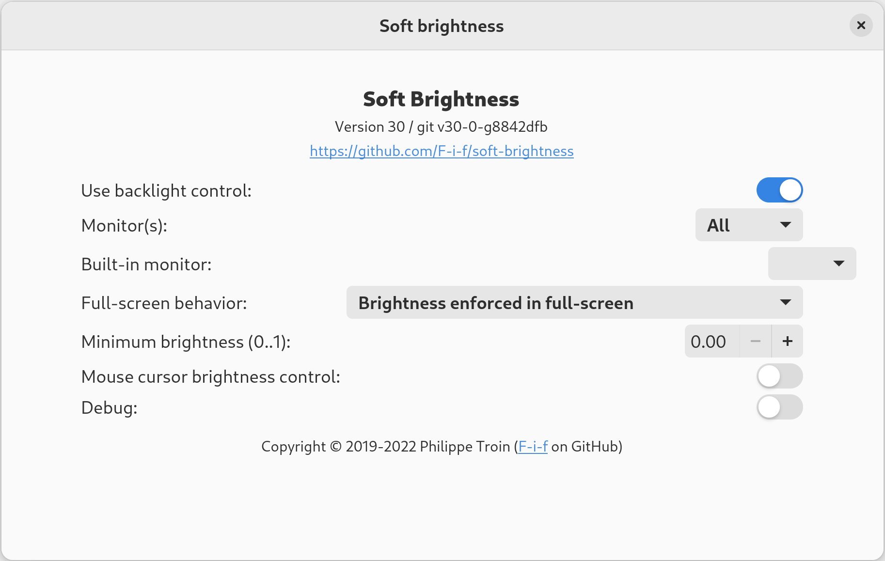
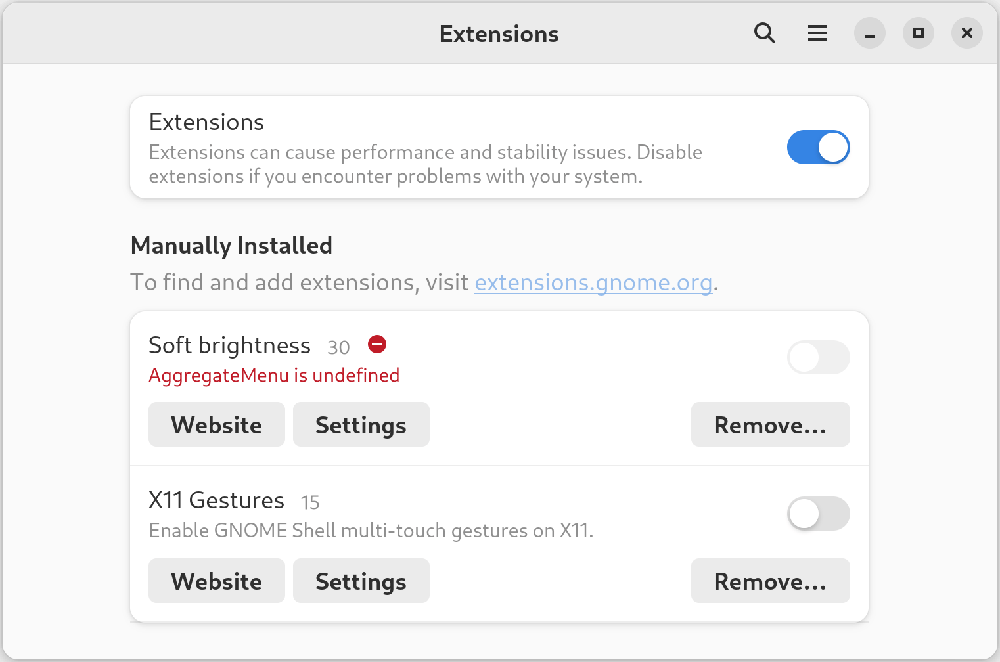
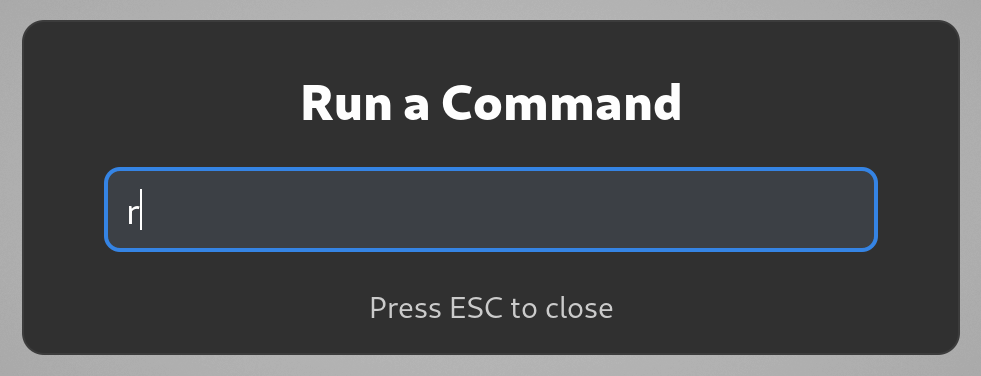
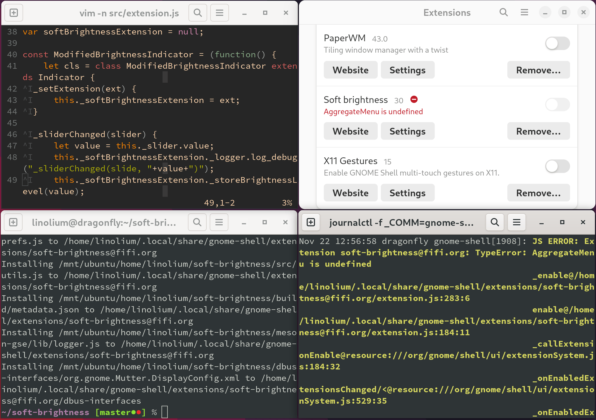
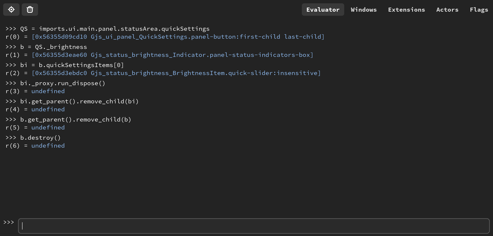
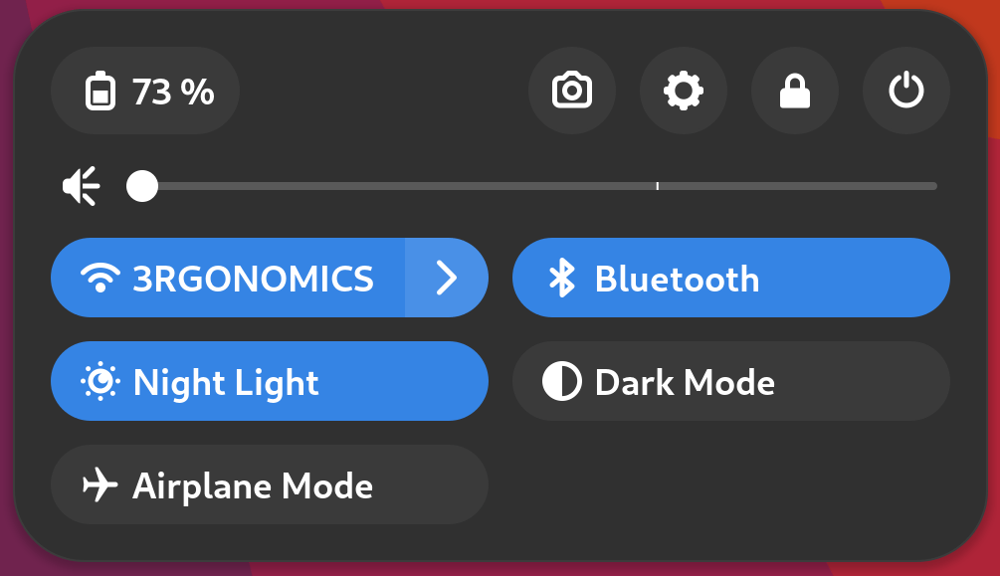
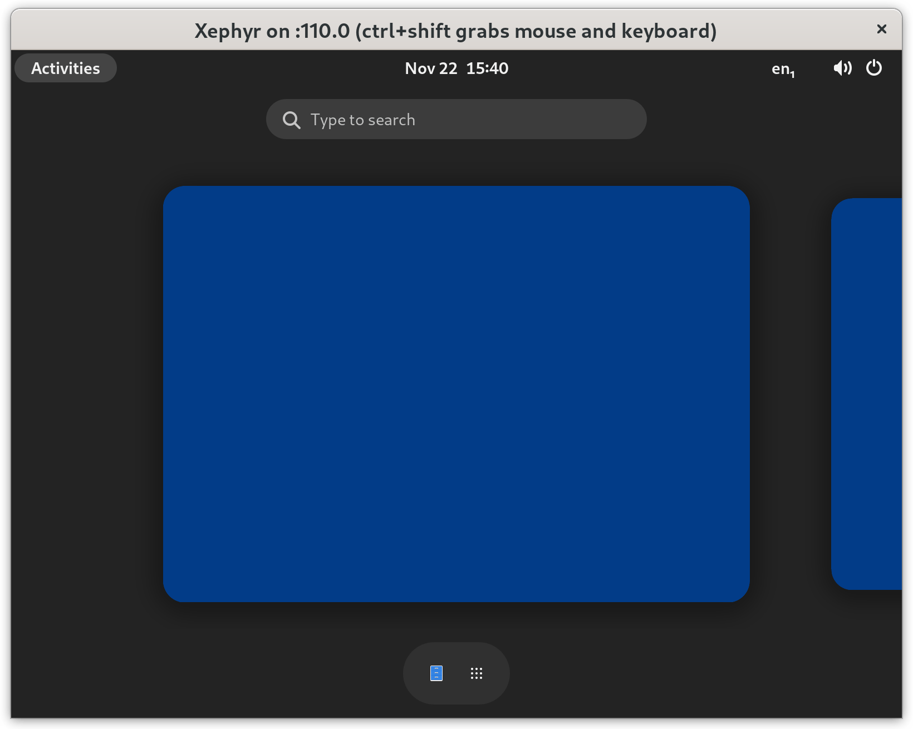

I used to be an exclusive user of tiling window managers, namely: xmonad.  When I converted over to the GNOME world, I tried all of the window tiling extensions and settled on the excellent [PaperWM](https://github.com/paperwm/PaperWM).  But PaperWM, as with most GNOME extensions, struggled to keep up with the rapid pace of GNOME releases, and I was stuck on vanilla GNOME for some time.

Recently, Arch pushed the GNOME 43 release, and, surprise! I lost another extension that I've come to love: Philippe Troin's [Soft Brightness](https://github.com/F-i-f/soft-brightness).  This extension takes the existing brightness control in GNOME, and extends the darkest setting past the limits of the physical display by adjusting gamma settings.  (In other words, it prevents you from going blind when working in a dark room.)  There was an [open issue for GNOME 43 support](https://github.com/F-i-f/soft-brightness/issues/58) on the Soft Brightness GitHub page, but before I wrote this post, no progress had yet been made.  Rather than downgrading GNOME and waiting patiently, I decided to take matters into my own hands.



# Update `metadata.json` and hope for the best

First of all, let's clone the Soft Brightness repository, and update `metadata.json` to claim support for GNOME 43.  The documentation shows the incantation to build and install the extension: `meson build && ninja -C build install`.  Great!  Let's re-enable the extension and see what happens.



Okay... so that didn't work very well.  There's something wrong with AggregateMenu.  Coincidentally, the guide for [porting extensions to GNOME 43](https://gjs.guide/extensions/upgrading/gnome-shell-43.html#quick-settings) mentions that AggregateMenu has been replaced with QuickSettings.  No problem!  We just need to search-and-replace a few strings, and the extension is ready for action.  But... seems like there's no way to "reload" the extension in a running GNOME session.

# Set up the development environment

GNOME might not allow reloading extensions dynamically, but there is a simple workaround: reload `gnome-shell` instead.  For all of you X11 users, go ahead and press Alt+F2 right now, type the `r` command, and hit \<Enter>.  Tah-dah!  For all of you Wayland users... I feel your pain.

When running in Wayland, `gnome-shell` also takes on the equivalent role of an X server, drawing UI elements to the display.  Thus, reloading `gnome-shell` in Wayland effectively brings down the entire session along with all of your running applications.



Apparently it's pretty easy to run a nested `gnome-shell` in Wayland, but it seems to have a lot of systemd-related issues.  For example, opening up most applications from the nested window results in them being opened in... the parent `gnome-shell`.  Huh?  Also, there is no brightness control in the nested window, which is pretty important if we are to get Soft Brightness working.  So... until we figure out how to get containers involved, I'm sad to say that for GNOME extension development, the easiest route is to temporarily switch over to an X11 session.

Once there, we can get our development workflow going:

1. Make changes to the extension source code
2. `ninja -C build install`
3. Alt+F2, `r` \<Enter>
4. Close and re-open `gnome-extensions-app`
5. Attempt to enable extension



Or for those who enjoy stringing commands together and avoiding tinkering with the UI:

```sh
$ gnome-extensions disable soft-brightness@fifi.org && \
    ninja -C build install && \
    killall -HUP gnome-shell && \
    sleep 3 && \
    gnome-extensions enable soft-brightness@fifi.org
```

Sometimes the one-line error provided by `gnome-extensions-app` is enough to track down the latest error.  But we can get more information (a full stack trace) by watching `gnome-shell` logs while reloading extensions.  On a systemd-based distribution, that amounts to running `journalctl -f _COMM=gnome-shell`.

# Validate a solution with Looking Glass

I quickly discovered that `s/AggregateMenu/QuickSettings/g` wasn't going to cut it.  My heart yearned for Chrome's Developer Tools, which lets you click a UI element to inspect its properties and position in the DOM.  And then the heavenly words appeared, glowing softly in my Google search: [Looking Glass](https://wiki.gnome.org/Projects/GnomeShell/LookingGlass).  Although nowhere near as advanced as Developer Tools, it allows us to inspect a running instance of `gnome-shell`, and interactively make modifications.

Looking Glass is accessible via Alt+F2 and then `lg`.  Honestly, it's somewhat frustrating to use, since it blocks interaction with the UI until closed with \<Esc>.  But for our purposes, it should be more than sufficient.



To familiarize ourselves with QuickSettings, let's see if we can remove the brightness indicator.  In order to figure out the correct set of instructions, we refer to (1) existing Soft Brightness code, (2) the commit used to convert the brightness indicator over to QuickSettings ([status/brightness: Port to quick settings](https://gitlab.gnome.org/GNOME/gnome-shell/-/commit/7bbd59838a6cfe14b189fa7bd8e743fb0cac9bc3)), and (3) an extension for customizing QuickSettings ([Quick Settings Tweaker](https://github.com/qwreey75/quick-settings-tweaks/blob/e7eab279bbe2cfaeb59a7068808166ac7c5c046d/features/dndQuickToggle.js)).  We lather liberally with trial and error, and come out with this Javascript:

```javascript
QS = imports.ui.main.panel.statusArea.quickSettings;
b = QS._settings;
bi = b.quickSettingsItems[0];
bi._proxy.run_dispose();
bi.get_parent().remove_child(bi);
b.get_parent().remove_child(b);
b.destroy();
```



And... it's gone! Well, that's rather satisfying, but slightly awkward. Let's reload `gnome-shell` to get it back.  (Again, sorry Wayland users!)


Fast-forward through some research, coding, and more trial and error.  In the end, I decided to go with a monkey-patching approach, keeping the existing brightness indicator in tact, but modifying its behaviour while the Soft Brightness extension is enabled.  For a more in-depth explanation, check out the [GitHub pull request](https://github.com/F-i-f/soft-brightness/pull/59).  But how can we test this approach on prior versions of GNOME? And perhaps, simplify the development process in general?

# Enter the star: x11docker

[x11docker](https://github.com/mviereck/x11docker) is a fairly mature project, designed to "run GUI applications in Docker or podman containers".  It looks like the focus of the project is on sandboxing and security, but turns out to work remarkably well for our own development and testing purposes, without needing to bring up a full virtual machine.



x11docker can be used to run either a single application, which is then seamlessly integrated into your current window manager, or a full desktop environment, which is what we will be using.  The project provides some pre-built Docker images such as `x11docker/gnome` to get started, but we will need to build our own since we have specific requirements of the GNOME version being used.

# x11docker custom GNOME Dockerfile

```docker
FROM fedora:36
RUN dnf -y update && \
    dnf -y install \
        @base-x \
        dbus-x11 \
        gnome-session \
        gnome-shell \
        gnome-terminal \
        gnome-extensions-app \
        nautilus \
        mesa-libGL \
        mesa-dri-drivers \
        && \
    dnf -y remove gnome-tour && \
    dnf clean all

CMD gnome-session
```

It took a lot of experimentation to get here, but this Dockerfile is all that is needed.  A few points to note:

- We choose to use Fedora because it conveniently has an almost one-to-one relationship with stable GNOME versions.  In this case, Fedora 36 uses GNOME 42.
- `@base-x` provides minimal X11 support.  `gnome-session` and `gnome-shell` are added, along with Terminal, Gnome Extensions App, and Nautilus.
- Mesa drivers are installed in case you'd like to use the `--gpu` flag with x11docker.
- `gnome-tour` is removed because it wants to take you on a tour every time the session starts.  No more tours, please!
- The last line starts up GNOME.  We use `gnome-session` instead of `gnome-shell`, since `gnome-session` provides dbus support needed for making screen brightness adjustments.

Here's a list of Fedora versions with corresponding GNOME versions (as of November 26, 2022) that work without any special modification of this Dockerfile aside from changing the first line:

| Fedora version | GNOME version |
|----|--------|
| 38 | 43.1   |
| 37 | 43.1   |
| 36 | 42.6   |
| 35 | 41.9   |
| 34 | 40.9   |
| 33 | 3.38.5 |
| 32 | 3.36.9 |

# x11docker command-line options

The actual invocation of `x11docker` is slightly more involved, and may need some customization depending on your goals:

```sh
x11docker \
  --verbose \
  --xephyr \
  --desktop \
  --size=1600x1200 \
  --sudouser \
  --clipboard \
  --init=systemd \
  --dbus \
  --network=host \
  --share=/run/udev/control \
  --share=/sys/class/backlight/intel_backlight \
  --share=$HOME/.local/share/gnome-shell/extensions \
  --runasuser='ln -s /home.host/.local/share/gnome-shell/extensions ~/.local/share/gnome-shell' \
  --runasuser='gsettings set org.gnome.desktop.interface scaling-factor 2' \
  --runasuser="gsettings set org.gnome.desktop.wm.keybindings panel-run-dialog \"['\\\\<Alt\\\\>F2','\\\\<Shift\\\\>F2']\"" \
  --runasuser="gsettings set org.gnome.desktop.input-sources sources \"`gsettings get org.gnome.desktop.input-sources sources`\"" \
  --runasuser='touch .local/share/gnome-shell/lock-warning-shown' \
  --xtest \
  -- \
  --cap-add=SYS_NICE \
  -- \
  gnome-shell-43
```

Here's an explanation of each line:

```sh
x11docker \
  --verbose \
```
Invoke x11docker with the verbose flag.  This means we won't need to bother with `journalctl`.

```sh
  --xephyr \
  --desktop \
  --size=1600x1200 \
```

Use the Xephyr client for remotely connecting to the X session and showing it in a nested window.  `--xpra` and `--weston-xwayland` also work reasonably well, and even allow dynamic resizing of the desktop.  But `--xephyr` is the only one that allows using a key combination (Ctrl+Shift) to grab the keyboard/mouse, which can be quite useful to avoid shortcuts getting intercepted by the host GNOME session.  There are also a bunch of other Wayland modes you can play with.  Check out [x11docker documentation](https://github.com/mviereck/x11docker/wiki/X-server-and-Wayland-Options) and find what works best with your setup.

```sh
  --sudouser \
  --clipboard \
```

Allow becoming the root user, and enable clipboard for copying text to and from the container.

```sh
  --init=systemd \
  --dbus \
```

GNOME is heavily dependent on dbus.  It also needs an initialization system to run properly.  Use systemd since it is most widely supported.

```sh
  --network=host \
  --share=/run/udev/control \
  --share=/sys/class/backlight/intel_backlight \
```

The first two lines are necessary to get udev events sent into the container.  In our case, that means GNOME knowing when brightness of the screen backlight has changed.  This one trumped me for a really long time, until I finally ran across this [terse blog post](https://dummdida.tumblr.com/post/121087781445/re-udev-events-in-a-container).  The last line is to allow write access to the backlight (in my case, `intel_backlight`) so that the `/usr/lib/gsd-power` binary is able to change brightness when requested via dbus.

```sh
  --share=$HOME/.local/share/gnome-shell/extensions \
  --runasuser='ln -s /home.host/.local/share/gnome-shell/extensions ~/.local/share/gnome-shell' \
```

Share the host's GNOME extensions directory.  This is where the Soft Brightness extension is installed when running `ninja -C build install`.  Note that the first line doesn't actually work due to a bug in x11docker.  I've uploaded a fix to this [x11docker issue](https://github.com/mviereck/x11docker/issues/475), but in the meantime, a workaround is to run `ln` manually with `--runasuser` (the second line).

```sh
  --runasuser='gsettings set org.gnome.desktop.interface scaling-factor 2' \
  --runasuser="gsettings set org.gnome.desktop.wm.keybindings panel-run-dialog \"['\\\\<Alt\\\\>F2','\\\\<Shift\\\\>F2']\"" \
  --runasuser="gsettings set org.gnome.desktop.input-sources sources \"`gsettings get org.gnome.desktop.input-sources sources`\"" \
  --runasuser='touch .local/share/gnome-shell/lock-warning-shown' \
```

Make GNOME slightly more usable in the container.  Enable HiDPI scaling (you may want to disable that).  Allow use of Shift+F2 to bring up the Run dialog, which is useful since Alt+F2 is intercepted by the host.  Use keyboard layout specified by the host (since I use Dvorak).  Four is the magic number of backslashes needed here, due to the way x11docker handles these strings.  Don't show the "No lock screen" warning when `gnome-shell` starts.

```sh
  --xtest \
```

Enable XTEST extension in X, which is required by `/usr/lib/gsd-power` in GNOME versions 3.30 and under.

```sh
  -- \
  --cap-add=SYS_NICE \
```

Everything after the first `--` is sent directly to the container engine (Docker by default).  Add the `SYS_NICE` capability, which is required to run the `gnome-shell` binary for versions 3.38 and under.

```sh
  -- \
  gnome-shell-43
```

After the second `--` comes the image name, and the command to run.  That defaults to whatever follows `CMD` in the Dockerfile, so we don't specify a command here.

WHEW!  Glad we got that over with.

# Go forth and conquer the GNOMEs


Now that we have the ability to run a containerized `gnome-shell` of arbitrary version, development becomes much simpler.  For each version of GNOME, I start up a container, enable the extension, test functionality, and make a few fixes along the way.  Once I am (relatively) certain the new code is working without a hitch, I upload a commit, and create a [GitHub pull request](https://github.com/F-i-f/soft-brightness/pull/59).  Hooray!

Now go forth, be brave, and update your favourite extensions to work with GNOME 43!

# Addendum

* [Schneegans/gnome-shell-pod](https://github.com/Schneegans/gnome-shell-pod): `gnome-shell` containers for automated testing purposes
