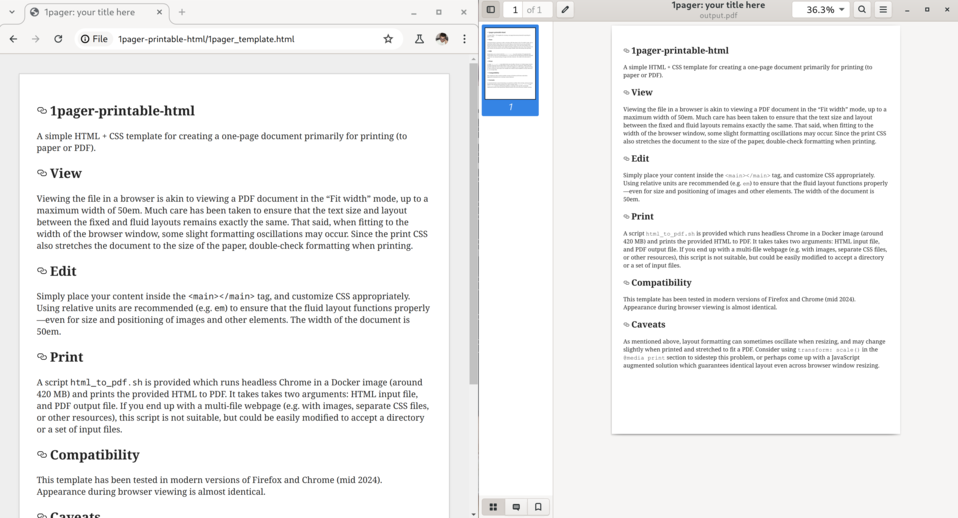

The resume I used for the majority of my life is a relic from university times, when I joined the Computer Science co-op program and applied for oodles of internship placements.  Back in the day, I designed the layout in Microsoft Word, with careful formatting constructed of tables, blank lines with font size 1, and painstakingly adjusted margins.  Word ran great with wine, and I even had a shell script set up to open a document and print it as PDF.

# Comparison of authoring software

Fast forward fifteen years.  My old resume still looks great, but I decide to give it a facelift, and update its content in the process.  At this point, I have entirely replaced use of Microsoft Word with Google Docs.  I attempt using Docs, which turns out to be a very poor experience.  I toy with re-installing Word again, but the idea of manually adjusting tables and margins again makes me shiver in fear.

I start looking at text-based solutions, which makes makes maintainability much simpler.  There is a strong cult of software engineers using LaTeX to write resumes, and quite a few templates are available.  LaTeX has that signature look to it, which many consider a secret "handshake" between competent engineers.  But IMHO it is not very suitable for pixel-perfect design with elements other than just text.  (Feel free to correct me if you feel otherwise!)

# HTML + CSS solution

In the end, I decide HTML + CSS is the perfect tool, since it easily versioned, and mocking up different layouts in CSS is ridiculously simple compared to the likes of Microsoft Word.  However, I discover two non-trivial points:

* How can I get the document to look great in a browser for previewing and possibly even publishing purposes?  Can the document stretch with the size of the browser viewport?

* How can I export the HTML page to PDF with pixel-perfect accuracy?  HTML to PDF conversion programs like pandoc typically have a poor understanding of complex CSS layout rules.

# Solution: 1pager-printable-html

After slowly working away at these two problems, I created a template on GitHub for one-page printable HTML + CSS documents.  Viewing the HTML in a browser looks similar to viewing a PDF document, with width stretching up to a maximum of 50em.  It looks professional, and could even be directly used for publishing documents online.  PDF conversion is accomplished by printing the document via headless Chrome, which is the best solution to get pixel-perfect output.  I wrote a short shell script which uses a Docker image to spawn a headless Chrome instance and save the PDF document to a specified file.

GitHub repository is available here, licensed under MIT: **[jkitching/1pager-printable-html](https://github.com/jkitching/1pager-printable-html)**

