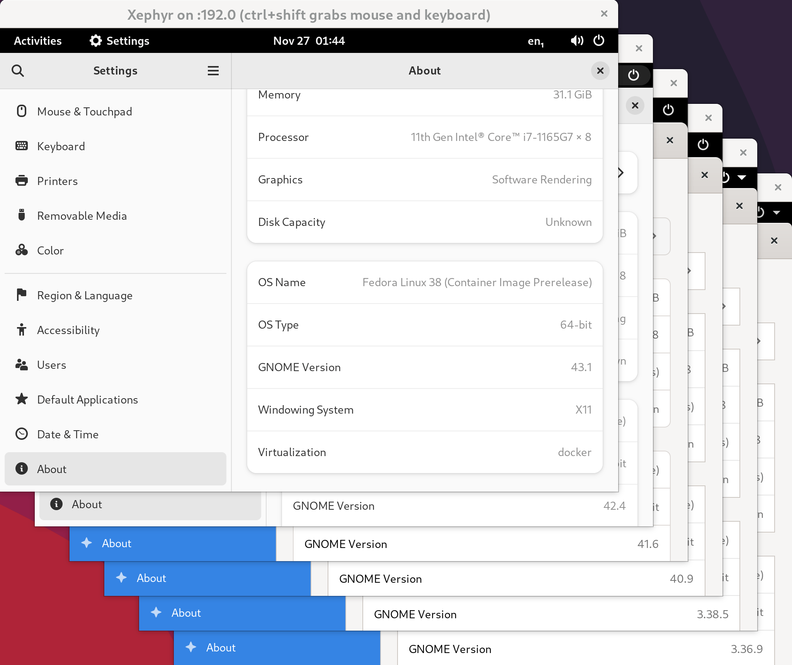
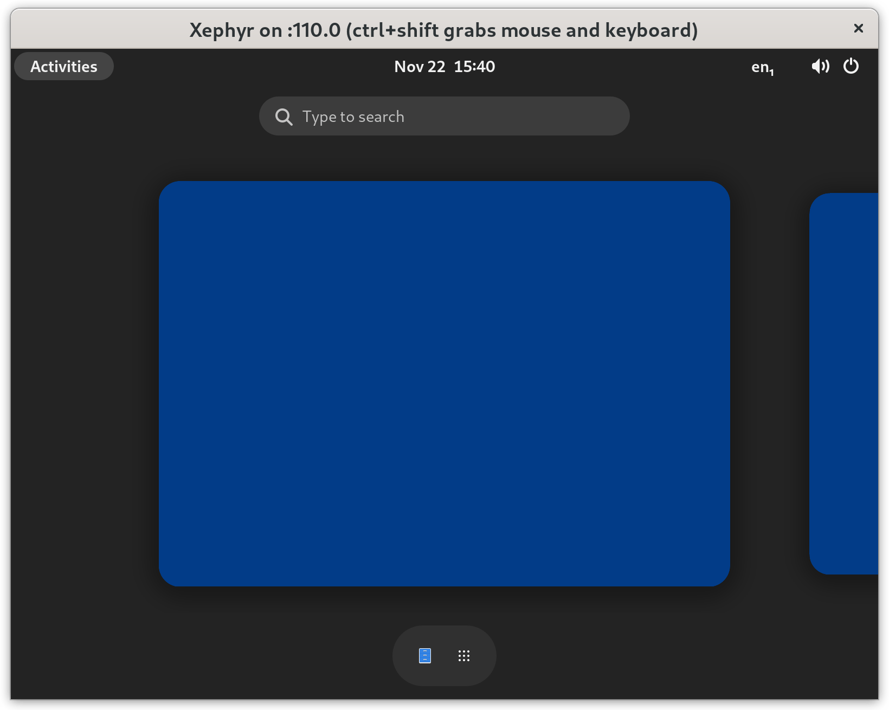

In , we looked at the general process of updating a GNOME extension to work on a newer version of GNOME.

The most obvious development environment for working on GNOME extensions is an active GNOME session.  But I encountered numerous pain points with this setup:

* **Reloading extensions:** This is possible in X by reloading `gnome-shell` with Alt+F2 and `r`, but impossible when running in Wayland.
* **Looking Glass usage:** Looking Glass (accessible via Alt+F2 and `lg`) is the Chrome Developer Tools of GNOME.  But while open, it blocks interaction with the UI, which can be quite inconvenient.  We may also want to experiment with some non-reversible changes to the GNOME DOM, after which a restart is needed.
* **Testing different versions:** New versions of GNOME are released every six months.  There are still plenty of folks using old versions of GNOME.  Short of booting up a VM, how do we ensure our extension is compatible with previous GNOME versions?

Today, we will learn how to run a slimmed-down GNOME environment of any arbitrary version within a container.

# Enter the star: x11docker

[x11docker](https://github.com/mviereck/x11docker) is a fairly mature project, designed to "run GUI applications in Docker or podman containers".  It looks like the focus of the project is on sandboxing and security, but turns out to work remarkably well for our own development and testing purposes, without needing to bring up a full virtual machine.



x11docker can be used to run either a single application, which is then seamlessly integrated into your current window manager, or a full desktop environment, which is what we will be using.  The project provides some pre-built Docker images such as `x11docker/gnome` to get started, but we will need to build our own since we have specific requirements of the GNOME version being used.

# x11docker installation

First, you'll need a container engine on your machine---this article uses Docker.  Next, see [x11docker documentation](https://github.com/mviereck/x11docker#installation-from-distribution-repositories) for installation instructions.  x11docker may be available as a package for your distribution, or you can install manually.

  It's worth mentioning that x11docker is crazy smart about other dependencies.  If these dependencies already exist on your system (like Xephyr, `xinit`, `xclip`, etc.), they will be used.  For any dependencies not installed, x11docker will automatically use dependencies from a container image created for this purpose.

Next up, we need a Dockerfile to describe the GNOME image.

# x11docker GNOME Dockerfile

```docker
FROM fedora:36
RUN dnf -y update && \
    dnf -y install \
        @base-x \
        dbus-x11 \
        gnome-session \
        gnome-shell \
        gnome-terminal \
        gnome-extensions-app \
        nautilus \
        mesa-libGL \
        mesa-dri-drivers \
        && \
    dnf -y remove gnome-tour && \
    dnf clean all

CMD gnome-session
```

It took a lot of experimentation to get here, but this Dockerfile is all that is needed.  A few points to note:

- We choose to use Fedora because it conveniently has an almost one-to-one relationship with stable GNOME versions.  In this case, Fedora 36 uses GNOME 42.
- `@base-x` provides minimal X11 support.  `gnome-session` and `gnome-shell` are added, along with Terminal, Gnome Extensions App, and Nautilus.
- Mesa drivers are installed in case you'd like to use the `--gpu` flag with x11docker.
- `gnome-tour` is removed because it wants to take you on a tour every time the session starts.  No more tours, please!
- The last line starts up GNOME.  We use `gnome-session` instead of `gnome-shell`, since `gnome-session` starts up numerous components on which our extension may depend.

```ini
# These components are started up with gnome-session.
# Source: /usr/share/gnome-session/sessions/gnome.session
org.gnome.Shell
org.gnome.SettingsDaemon.A11ySettings
org.gnome.SettingsDaemon.Color
org.gnome.SettingsDaemon.Datetime
org.gnome.SettingsDaemon.Housekeeping
org.gnome.SettingsDaemon.Keyboard
org.gnome.SettingsDaemon.MediaKeys
org.gnome.SettingsDaemon.Power
org.gnome.SettingsDaemon.PrintNotifications
org.gnome.SettingsDaemon.Rfkill
org.gnome.SettingsDaemon.ScreensaverProxy
org.gnome.SettingsDaemon.Sharing
org.gnome.SettingsDaemon.Smartcard
org.gnome.SettingsDaemon.Sound
org.gnome.SettingsDaemon.UsbProtection
org.gnome.SettingsDaemon.Wacom
org.gnome.SettingsDaemon.XSettings
```

Here's a list of Fedora versions with corresponding GNOME versions (as of December 5, 2022), along with any modifications required to the base Dockerfile shown above:

| Fedora version | GNOME version | | |
|----|--------|--|--|
| 38 | 43.1   | § |
| 36 | 42.4   |
| 35 | 41.6   |
| 34 | 40.9   |
| 33 | 3.38.5 |
| 32 | 3.36.9 |
| 31 | 3.34.8 | Δ | † |
| 30 | 3.32.2 | Δ |
| 29 | 3.30.2 | Δ | ‡ |
| 28 | 3.28.2 | Δ |
| 27 | 3.26.2 | Δ |
| 26 | 3.24.2 | Δ |

* § Both Fedora 37 and 38 run GNOME 43, so I just used the newest of the two.
* Δ Predates `gnome-extensions-app`, so don't install this package.  The binary `gnome-shell-extension-prefs` is bundled with `gnome-shell` instead.
* † `systemd-login` refuses to start without a patch to `systemd-login.service`.
* ‡ Requires a polkit patch to stop requesting authentication to create a managed color device on start.

**What about versions of GNOME prior to 3.24.2?**  In short, x11docker was refusing to boot GNOME on Fedora 25, and I figured the need to support pre-2017 setups is quite low.  If you can get it working, please let me know!

# x11docker command-line options

The actual invocation of `x11docker` is slightly more involved, and may need some customization depending on your goals:

```sh
x11docker \
  --verbose \
  --xephyr \
  --desktop \
  --size=1600x1200 \
  --sudouser \
  --clipboard \
  --init=systemd \
  --dbus \
  --network=host \
  --share=/run/udev/control \
  --share=/sys/class/some/device \
  --share=$HOME/.local/share/gnome-shell/extensions \
  --runasuser='ln -s /home.host/.local/share/gnome-shell/extensions ~/.local/share/gnome-shell' \
  --runasuser='gsettings set org.gnome.desktop.interface scaling-factor 2' \
  --runasuser="gsettings set org.gnome.desktop.wm.keybindings panel-run-dialog \"['\\\\<Alt\\\\>F2','\\\\<Shift\\\\>F2']\"" \
  --runasuser="gsettings set org.gnome.desktop.input-sources sources \"`gsettings get org.gnome.desktop.input-sources sources`\"" \
  --runasuser='touch .local/share/gnome-shell/lock-warning-shown' \
  --xtest \
  -- \
  --cap-add=SYS_NICE \
  -- \
  gnome-shell-43
```

Here's an explanation of each line:

```sh
x11docker \
  --verbose \
```
Invoke x11docker with the verbose flag.  This means we won't need to bother with `journalctl`.

```sh
  --xephyr \
  --desktop \
  --size=1600x1200 \
```

Use the Xephyr X server, which runs in a nested window, and waits for a connection from `gnome-shell`.  `--xpra` and `--weston-xwayland` also work reasonably well, and even allow dynamic resizing of the desktop.  But `--xephyr` is the only option that allows using a key combination (Ctrl+Shift) to grab the keyboard/mouse, which can be quite useful to avoid shortcuts getting intercepted by the host GNOME session.  There are also a bunch of other Wayland modes you can play with.  Check out [x11docker documentation](https://github.com/mviereck/x11docker/wiki/X-server-and-Wayland-Options) and find what works best with your setup.

```sh
  --sudouser \
  --clipboard \
```

Allow becoming the root user (the password is `x11docker`), and enable clipboard for copying text to and from the container.

```sh
  --init=systemd \
  --dbus \
```

GNOME is heavily dependent on dbus.  It also needs an initialization system to run properly.  Use systemd since it is most widely supported.

```sh
  --network=host \
  --share=/run/udev/control \
  --share=/sys/class/some/device \
```

This one trumped me for a really long time, until I finally ran across this [terse blog post](https://dummdida.tumblr.com/post/121087781445/re-udev-events-in-a-container).  If you are doing development which interacts with hardware in some way, you will likely need this section.

The first two lines are necessary to get udev events sent into the container.  This gives GNOME access to events such as when an external hard drive is connected, or when brightness of the screen is adjusted.  The last line is to allow write access to some device in the system.  For example, controlling the WiFi module, or turning on the camera.

```sh
  --share=$HOME/.local/share/gnome-shell/extensions \
  --runasuser='ln -s /home.host/.local/share/gnome-shell/extensions ~/.local/share/gnome-shell' \
```

Share the host's GNOME extensions directory.  Note that the first line doesn't actually work due to a bug in x11docker.  I've uploaded a fix to this [x11docker issue](https://github.com/mviereck/x11docker/issues/475), but in the meantime, a workaround is to run `ln` manually with `--runasuser` (the second line).

Also note that you don't necessarily have to share the same extensions directory as the host---you could also create a separate directory entirely.

```sh
  --runasuser='gsettings set org.gnome.desktop.interface scaling-factor 2' \
  --runasuser="gsettings set org.gnome.desktop.wm.keybindings panel-run-dialog \"['\\\\<Alt\\\\>F2','\\\\<Shift\\\\>F2']\"" \
  --runasuser="gsettings set org.gnome.desktop.input-sources sources \"`gsettings get org.gnome.desktop.input-sources sources`\"" \
  --runasuser='touch .local/share/gnome-shell/lock-warning-shown' \
```

Make GNOME slightly more usable in the container.  Enable HiDPI scaling (if your screen has a decent DPI).  Allow use of Shift+F2 to bring up the Run dialog, which is useful since Alt+F2 is intercepted by the host.  Use keyboard layout specified by the host (since I use Dvorak).  (Four is the magic number of backslashes needed here, due to the way x11docker handles these strings.)  Don't show the "No lock screen" warning when `gnome-shell` starts.

```sh
  --xtest \
```

Enable the XTEST extension in X, which is required by `/usr/lib/gsd-power` in GNOME versions 3.30 and under.

```sh
  -- \
  --cap-add=SYS_NICE \
```

Everything after the first `--` is sent directly to the container engine (Docker by default).  Add the `SYS_NICE` capability, which is required to run the `gnome-shell` binary for versions 3.38 and under.

```sh
  -- \
  gnome-shell-43
```

After the second `--` comes the image name, and then the command to run.  The command defaults to whatever follows `CMD` in the Dockerfile (in our case, `gnome-session`), so we don't need to specify that here.

WHEW!  That was a mouthful.

# Simplify invocation

To simplify the whole process of starting up a GNOME container with x11docker, I created the GitHub repo [jkitching/x11docker-gnome](https://github.com/jkitching/x11docker-gnome).  In it, you will find the following files:

* **gnome-shell-XYZ.Dockerfile:** The Dockerfile necessary to build a container image for GNOME XYZ.  Mostly they are identical, except for the differences mentioned in the table above.  I went against the grain here and didn't create a separate directory for each one.
* **[Makefile](https://github.com/jkitching/x11docker-gnome/blob/main/Makefile):** The Makefile allows building, pushing, pulling, and running of each image.  Running in this case is just invoking `/bin/bash`---for starting with x11docker, see `run-gnome-desktop.sh.template`.
* **[run-gnome-desktop.sh.template](https://github.com/jkitching/x11docker-gnome/blob/main/run-gnome-desktop.sh.template):** Rather than relying on your shell history to store the above huge x11docker invocations, copy this shell script template and make adjustments for your specific use case.

The recommended workflow is as follows:

```sh
# Pull all images from Docker Hub:
#   docker.io/jkitching/gnome-shell-XYZ
make pull all

# Copy the run shell script template
cp run-gnome-desktop.sh.template run-gnome-desktop.sh
chmod +x run-gnome-desktop.sh

# Make modifications as necessary
vim run-gnome-desktop.sh

# Start GNOME container with x11docker
./run-gnome-desktop.sh gnome-shell-39
```

x11docker also has a pretty neat way of saving command-line option templates in `~/.config/x11docker/preset`, but unfortunately using this method precludes dynamically generating arguments such as the `org.gnome.desktop.input-sources` setting above.  Check out the [Preconfiguration with `--preset`](https://github.com/mviereck/x11docker#preconfiguration-with---preset) section of documentation for details.

# Go forth and conquer the GNOMEs

Now that we have the ability to run a containerized `gnome-shell` of any arbitrary version, development becomes much simpler.  For example, when validating that your extension works in previous versions of GNOME, simply start up a container, enable the extension, test functionality, and make a few fixes along the way.

Now go forth, be brave, and use the power of containers to supercharge your GNOME development!

# Addendum

* Each Linux system is set up differently, running on unique hardware configurations.  As such, it's highly likely you may encounter some difficulty in getting the GNOME containers to start up properly on your system.  Play around with command-line options, search Google liberally, and check out x11docker's detailed [README documentation](https://github.com/mviereck/x11docker) and [GitHub Wiki](https://github.com/mviereck/x11docker/wiki).
* I briefly considered grabbing specific versions of `gnome-shell` from the Fedora ["koji" build system](https://koji.fedoraproject.org/koji/packageinfo?packageID=9009).  Which would be super cool---instant access to a running GNOME instance of *any* version, not just the latest stable versions.  But realistically, unless someone is tracking down a very specific GNOME bug, I don't think there are many use cases.  Maybe next time!
* [Schneegans/gnome-shell-pod](https://github.com/Schneegans/gnome-shell-pod) provides `gnome-shell` containers for automated testing of GNOME extensions on different GNOME versions.  There is a decent amount of overlap here, and perhaps some collaboration could be in order.
